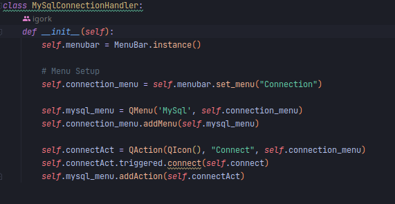

napraviti plugin manager ili nesto tome slicnova

treba da ima listu pluginova, u nasem slucajuy MySqlHandler(), koji se instancira i poziva metodate
activate, ako je uspeno dodaje se u listu akrivnih pluginova,

Priliko uklanjana plugina, pozvati metodu deactivate, i ako je uspena izbaciti plugin iz lista aktivnih pluginova,

Prikac dostupnih pluginova izvesti u vidu menu itema (Plugins.(Lista pluginova kao pod meni opcije))
? Razmisliti koji mehanizam (Prika, da li dodatni meni sa activate i deactive optijcama, ili clik na plugin...)je dobar za aktivaciju i deaktivaciju plugina( )

primer dodavanja funkcionalnosti u meni

- Kreirati novu granu ComponentRegisty iz izvedene grane Development, i raditi iskljucivo u toj grani
- Raditi iskljucivo u fajlu main.py, i foldery app/PluginLikeStuff, po zelji se moze promeniti naziv 
- Interfejs Plugin, ne menjati.